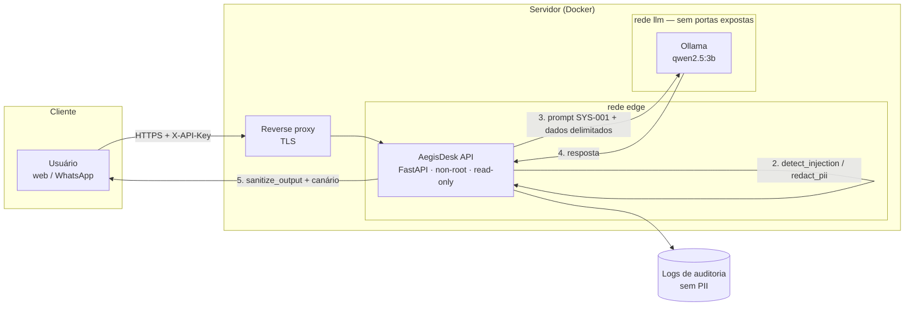
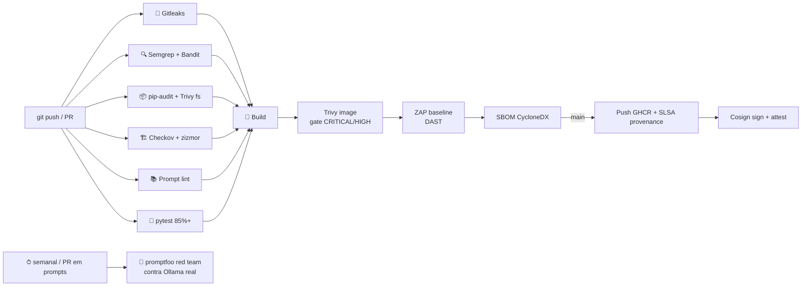

# Arquitetura

```mermaid
flowchart LR
  subgraph Cliente
    U[Usuário<br/>web / WhatsApp]
  end
  subgraph Host["Servidor (Docker)"]
    RP[Reverse proxy<br/>TLS]
    subgraph edge[rede edge]
      API[AegisDesk API<br/>FastAPI · non-root · read-only]
    end
    subgraph llm[rede llm — sem portas expostas]
      OL[Ollama<br/>qwen2.5:3b]
    end
  end
  LOG[(Logs de auditoria<br/>sem PII)]

  U -->|HTTPS + X-API-Key| RP --> API
  API -->|1. limites + auth + rate limit| API
  API -->|2. detect_injection / redact_pii| API
  API -->|3. prompt SYS-001 + dados delimitados| OL
  OL -->|4. resposta| API
  API -->|5. sanitize_output + canário| U
  API --> LOG
```

## Pipeline

```mermaid
flowchart LR
  A[git push / PR] --> B[🔑 Gitleaks]
  A --> C[🔍 Semgrep + Bandit]
  A --> D[📦 pip-audit + Trivy fs]
  A --> E[🏗️ Checkov + zizmor]
  A --> F[📚 Prompt lint]
  A --> G[🧪 pytest 85%+]
  B & C & D & E & F & G --> H[🐳 Build]
  H --> I[Trivy image<br/>gate CRITICAL/HIGH]
  I --> J[ZAP baseline<br/>DAST]
  J --> K[SBOM CycloneDX]
  K -->|main| L[Push GHCR + SLSA provenance]
  L --> M[Cosign sign + attest]
  N[⏱ semanal / PR em prompts] --> O[🎯 promptfoo red team<br/>contra Ollama real]
```
